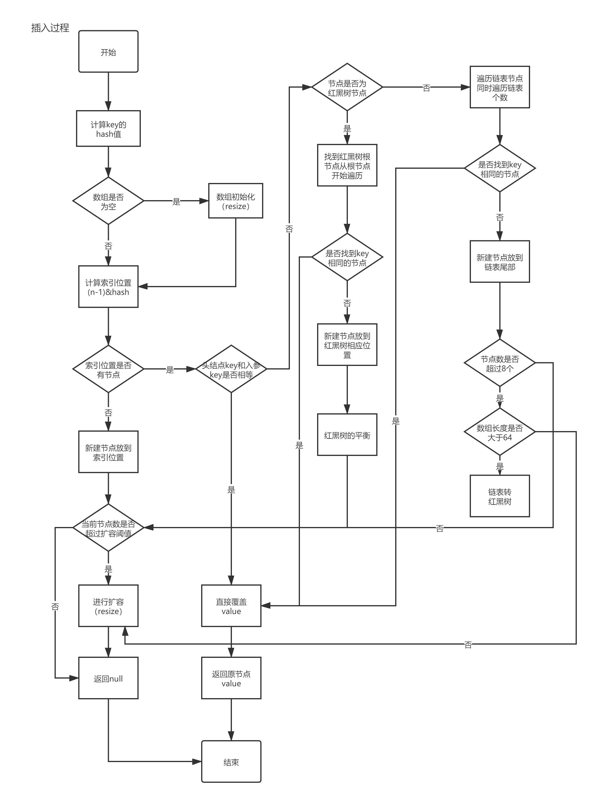

# 学习笔记          
## 做题心得     
### 滑动窗口最大值——剑指offer59
1. 头部出队，清理超范围，保证窗口的长度范围
2. 移除尾部，小于当前值的元素
3. 尾部加入，滑动窗口向右扩充
4. 从头部返回最大值               

## HashMap源码分析            
### 元素插入(put)过程

### get过程
1. get()方法——get返回一个数据节点, 如果不存在则返回空
2. getNode()方法——通过 hash & (table.length - 1)获取该key对应的数据节点的hash槽;
3. 判断首节点是否为空, 为空则直接返回空;
4. 再判断首节点.key 是否和目标值相同, 相同则直接返回
5. 首节点.next为空, 则直接返回空;
6. 首节点是树形节点, 则进入红黑树数的取值流程, 并返回结果;
7. 进入链表的取值流程, 并返回结果。     

### jdk1.8对HashMap的优化
1. 底层数据结构从“数组+链表”————>“数组+链表+红黑树”，主要是优化了hash冲突较严重时，链表过长的查找性能：O(n)————>O(LogN).
2. 计算table初始容量的方式发生了变化，老的方式是从1开始不断向左进行位移运算，直到找到大于或等于入参容量的值，新的方式是通过“5个位移+或等于运算”来计算
3. 优化了hash值的计算方式，新的是让hashcode的高低16位进行异或运算。
4. 计算索引位置：（n-1）&hash,达到了和取模同样的效果，实现了均匀分布，但是&运算比mod具有更高的效率
5. 扩容时插入方式从“头插法”改成“尾插法”，避免了并发下的死循环